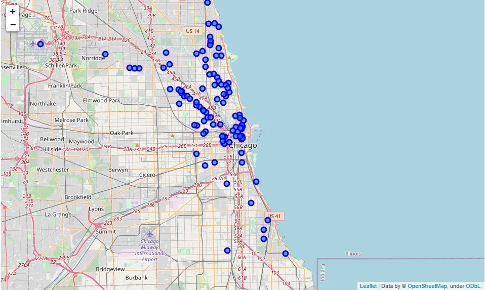
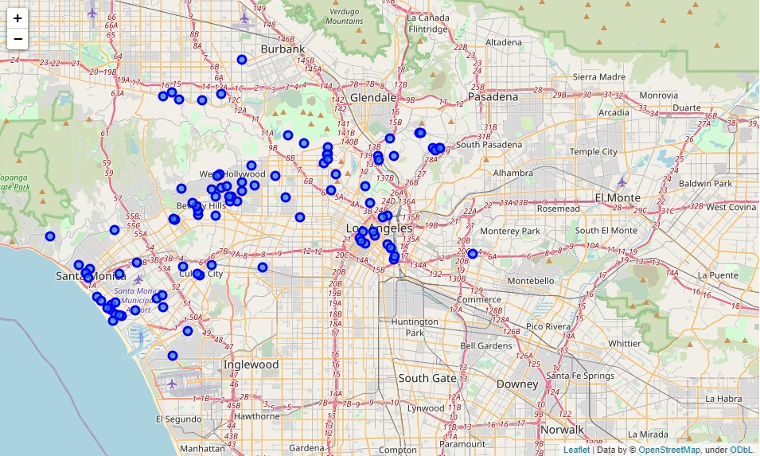

# Coffee Lovers guide to America - comparing five major US cities

----------------------------------------------------------------------------------------------------------------------
 Felix Reznitskiy
 
 December 18, 2020
 
----------------------------------------------------------------------------------------------------------------------

## Introduction


Coffee first became popular in the U.S. after the Boston Tea Party, when the switch was seen as “patriotic,” [according to PBS](http://www.pbs.org/food/the-history-kitchen/history-coffee/). And since Starbucks debuted in 1971, the drink is now accessible almost anywhere you go. A recent survey by the National Coffee Association found that [62 percent](https://www.ncausa.org/Newsroom/NCA-releases-Atlas-of-American-Coffee) of Americans drink coffee every day, with the average coffee drinker consuming 3 cups daily.
What gave way to java culture? Science, for one, has convinced us that caffeine possesses multiple health benefits besides mental stimulation. At the right dosages, caffeine may contribute to [longevity](https://time.com/5326420/coffee-longevity-study/). Perhaps just as important, though, is coffee’s social purpose. Today, coffee stations are a staple of the workplace, and tens of thousands of shops serve as meeting places for friends, dates and coworkers – though in 2020 many have had to provide take-out service only due to the COVID-19 pandemic.

## Business Problem

Our customer wants to open a coffee beans roasting facility in one of the major US cities. In order for the new business to be successful, he needs to find the best location for the new place. Therefore, we are requested to find the city and the neighborhood with the highest density of coffee shops.
To determine the best city for the new business, we will find a major city with the highest density of coffee shops out of five major US cities. Next, we will compare the neighborhoods to determine the one with the highest density.

## Data Description

We will fetch data about coffee shops in following 5 largest US cities:
 -	New York City, NY (Population: 8,622,357)
 -	Los Angeles, CA (Population: 4,085,014)
 -	Chicago, IL (Population: 2,670,406)
 -	Houston, TX (Population: 2,378,146)
 -	Phoenix, AZ (Population: 1,743,469)

Using geopy we will find the coordinates for each city center and then using Foursquare API we will collect the coffee shops data. After the data collection we will visualize each city data on a separate Folium map. Then we will measure the density, and we will merge the results into a single table which will be sorted to find the winning city. City with the highest density (lowest mean distance) will be considered the best.


### 1. Geocoders

We require geographical location data for each of the five cities. City center information will be used as a starting point for the FourSquare API (we will run search query around particular geographical location). We will use geopy.geocoders to obtain the city center coordinates for each of the five cities:
- city
- latitude
- longitude

### 2. Foursquare API

We need to make sure we are fetching only coffee shops during the Foursquare API search.
We will run Foursquare API once, and we will fetch one coffee-shop from one city in order to extract the category Id of "Coffee Shop". This Id will be used to limit the search and fetch only one venue category.
- category name
- category Id

After the city center information and category Id are fetched, we will run the FourSquare API search query and pull the list of coffee shops for each city:
- venue name
- venue category
- latitude
- longitude

We will create a Folium map for each city and visualize all the data to make a preliminary analysis of coffee shops density.

Next, we will use this data for measuring the density of coffee shops in selected cities. We will measure density as a mean distance from venues to the city center coordinates. City with the lowest mean distance will be considered as the best.

We will also measure the density as a mean distance from venues to the mean coordinates of all the coffee shops in the city. Then we will create a dataframe with the following columns:
- City
- Average_Proximity_To_The_City_Center
- Average_Distance_To_Mean_Coordinates
- Coffee_Shops_Per_City

As I mentioned above, the city with the lowest mean distance will be considered as the best.

### 3. Public databases / websites scraping

In order to segment the neighborhoods and explore them, we will essentially need a dataset that contains all the boroughs and the neighborhoods that exist in each borough as well as the the latitude and logitude coordinates of each neighborhood.
We will use the nested JSON file provided as part of one of the labs during the course: newyork_data.json.

Following features will be extracted from the JSON file:

- Borough
- Neighborhood
- Latitude
- Longitude

After the best city is found, we will use K-Means clustering to find the neighborhoods with the highest density of coffee shops. We are going to utilize the pandas dataframes and Folium maps to cluster the venues and present the findings on the map.

The following features will be used for the map creation and clustering:
 - Neighborhood Latitude (extracted from JSON file)
 - Neighborhood Longitude (extracted from JSON file)
 - Venue Latitude (extracted from Foursquare API)
 - Venue Longitude (extracted from Foursquare API)
 - Cluster Labels (generated)


## Methodology

### 1. Python libraries used

Numpy - library for working with arrays, vectors etc.

Pandas - library for data analsysis

Requests - library to handle requests

Folium - library for generating the maps

Json - library to handle JSON files
Json_normalize from pandas.io.json - library to flatten nested JSON in Pandas

Math - built-in module that you can use for mathematical tasks, has a set of methods and constants

KMeans from Sklearn.cluster - we will be using k-means clustering later to visualize the best neighborhoods' venues

Geopy.geocoders-Nominatim - used to convert an address into latitude and longitude values

### 2. Exploratory data analysis

Three kinds of maps were built during the analysis:

1. City map with the venues (five maps, one per each of five cities)
        This type of analysis provides us with a visualization of venues density in the particular city, 
        which is very useful for the task of finding the most dense area.    

New York, NY:


Chicago, IL:



Los Angeles, CA:



Houston, TX:


Phoenix, AZ


2. City map with the neighborhoods - to vizualize all 5 boroughs and 306 neighborhoods we are going to compare.  


3. Borough map with the clustered venues - to visualize the overall analysis results on the map.
    


### 3. Inferential statistical testing

Basic statistics were used to compare the cities - we calculated the mean distance and mean coordinates to prove our observations on the maps were correct.

In order to justify the above observations, we will measure the density and create a table with the concrete numbers.
Let's use two methods of calculations - we will calculate average distance from coffee shops to the corresponding city center, and also average distance of the venues to their mean coordinates.


### 4. What machine learnings were used and why

K-means clustering is one of the simplest and popular unsupervised machine learning algorithms.

It is very useful for visualizing the findings on the map thus it was used for display of analysis results.


# Results

Based on the analysis results, we were able to find the best location for a new business. The most attractive area for the new coffee beans roasting facility is Manhattan, and it’s five neighborhoods. Please see the details below:

1. The best city:
    We can see that New York has the highest density of coffee shops.
    Therefore, we pronounce New York the best city for coffee lovers!!!
2. Best borough: Manhattan (148 coffee shops)
3. Top five neighborhoods are:
    - Financial District (12)
    - Carnegie Hill (8)
    - Chelsea (8)
    - Civic Center (7)
    - Upper East Side (7)

# Conclusion


This concludes the report.


```python

```
